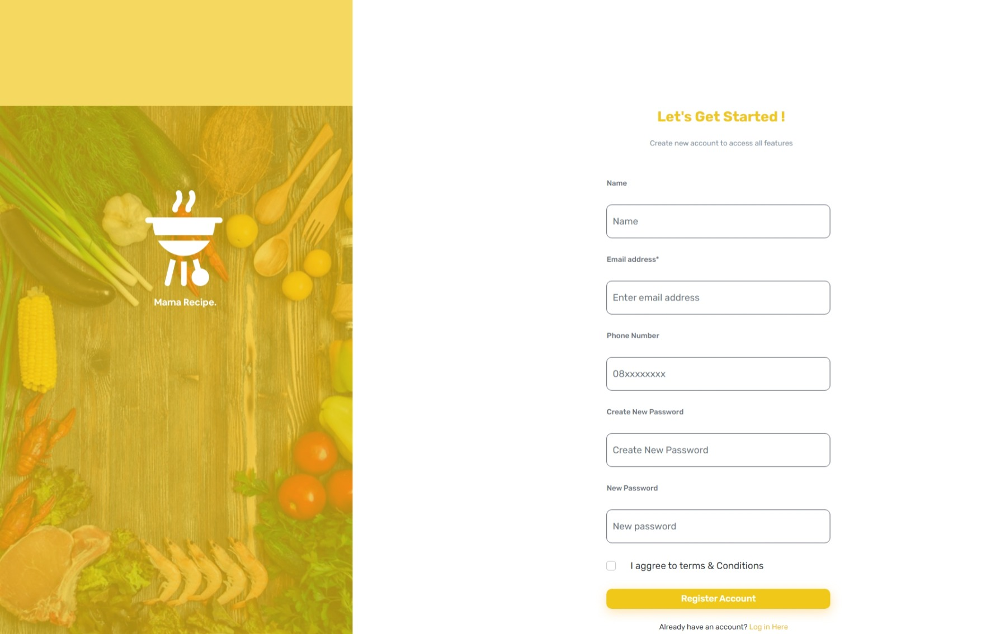
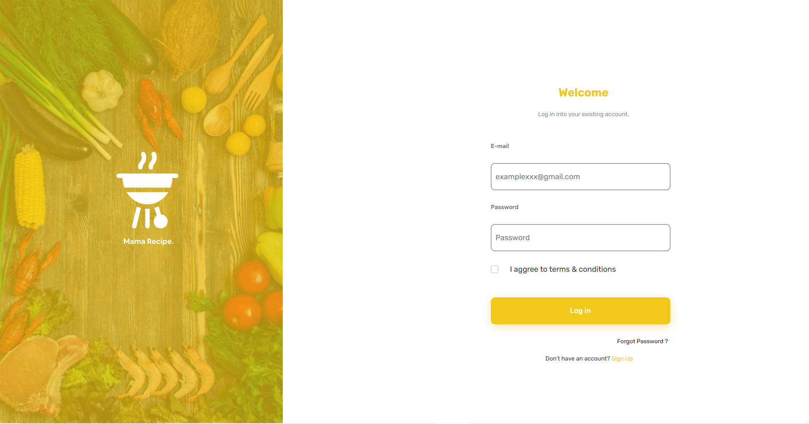
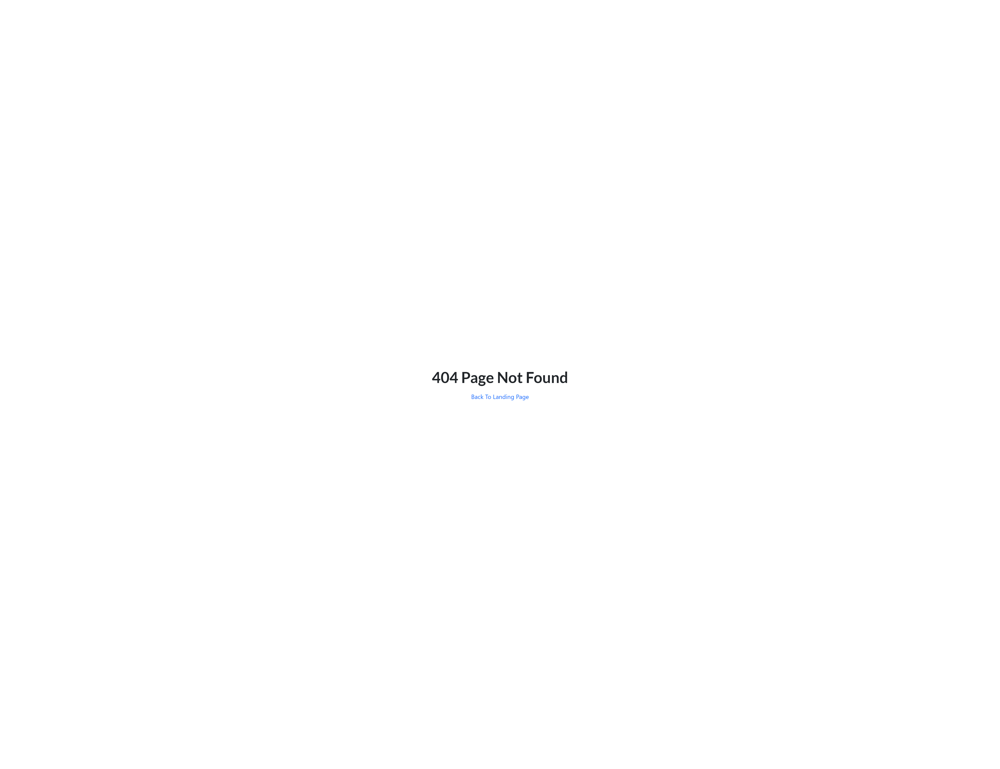

<h1 align="center">
  <a href="https://github.com/Alamnzr123/slicing-foodtemplate">
  Mama Recipe Application
  </a>
  <br />
</h1>

## Table of contents

- [Getting Started](#Getting-Started)
- [Description](#Description)
- [Project Structure](#Project-Structure)
- [Screenshoots](#Screenshoots)
- [Related Project](#Related-Project)
- [Contributing](#Contributing)
- [License](#License)

## Getting Started

This is a [ReactJS](https://react.dev/) project bootstrapped with [`create-react-app`](https://react.dev/learn/installation).

First, Install package

```bash
npm install
```

run the development server:

```bash
npm run start
```

Open [http://localhost:3000](http://localhost:3000) with your browser to see the result.

## Description

Mama Recipe Application helps you create new mock-up and add Food. Try this template, you can change design and add new features like
Search, Order, Cart. This website require ReactJS for frontend support.

## Project Structure

```
|── Frontend
   |── public          # Asset Public
   |── src             # Project source code
       |── Assets      # Image that store use multer
       |── Components  # Layouts
       |── Router      # Endpoint
   |── .gitignore      # File name for not uploaded on github
   |── .README.md      # For Readme In github
```

## Usage

```Javascript
npm install
```

## Framework

\
[ReactJS](https://react.dev/)

## Screenshoots

<details>
  <summary>
    Landing Page
  </summary>

</details>

<details>
  <summary>
    Reset Password
  </summary>

</details>

<details>
  <summary>
    Reset Passcode
  </summary>

</details>

<details>
  <summary>
   Forgot Password
  </summary>

</details>

<details>
  <summary>
   Register
  </summary>

</details>

<details>
  <summary>
   Login
  </summary>

</details>

<details>
  <summary>
   Error
  </summary>

</details>

## Related Project

RESTful API for this web application, clone this for development Foodtemplate.\
[backend-slicingfoodtemplate](https://github.com/Alamnzr123/backend-slicingfoodtemplate)

## Contributing

Pull requests are welcome. For major changes, please open an issue first to discuss what you would like to change.

Please make sure to update tests as appropriate.

## Docker & Local Troubleshooting (what we changed and why)

This project can be served as a static React build via nginx (recommended for testing with Docker) or run in development mode using `npm start`.

Recently we found an issue where the frontend attempted to call an API URL using the hostname `host.docker.internal` from the browser and requests failed with net::ERR_NAME_NOT_RESOLVED or ERR_SSL_PROTOCOL_ERROR. The main cause and the actions taken are documented below so future contributors won't get blocked.

What was wrong

- The React bundle was being built (or a checked-in built bundle existed) that pointed the frontend at `http://host.docker.internal:4000/api`. That hostname is meaningful inside Docker, but not resolvable by the browser on the host in many environments, so browser requests failed.
- A local `.env` file that contained recursive environment interpolations caused `npm run build` inside Docker to crash with a `dotenv-expand` stack overflow. This was because CRA uses dotenv and `dotenv-expand` to expand env variables during build.

What we changed

- Frontend Dockerfile: default build ARG `REACT_APP_BACKEND_URL` set to `http://localhost:4000/api` so builds target a host-accessible gateway by default.
- `docker-compose.yml`: build args & environment updated to use `http://localhost:4000/api` when running on a local machine.
- `.dockerignore`: local `.env` and `.env.*` are excluded from the Docker build context to avoid leaking local env files into the image.
- Deleted a checked-in built JS bundle that contained a stale `host.docker.internal` reference. Static bundles should not be committed to the repo (they are build artifacts).
- Updated documentation files `DOCKER.md` and `README.DOCKER.md` to recommend `http://localhost:4000/api` for browser-accessible gateway testing and added PowerShell-friendly examples.

Why this fixes it

- The React build bakes the value of `REACT_APP_BACKEND_URL` into the static bundle. Using `http://localhost:4000/api` ensures the browser can resolve the gateway URL and reach the backend through the gateway running on the host.
- Excluding local `.env` files prevents `dotenv-expand` recursion errors during `npm run build` inside Docker images.

How to reproduce the fixed workflow (PowerShell)

1. Build and run the backend stack (Postgres, Redis, API + gateway)

```powershell
# from f:\slicing-fullstack\backend-slicing-foodtemplate
docker-compose up --build -d
# tail logs to confirm gateway started on port 4000
docker-compose logs -f --tail=50
```

2. Build and run the frontend (static build served by nginx)

```powershell
# from f:\slicing-fullstack\slicing-foodtemplate
# uses the npm helper which calls `docker-compose up --build -d`
npm run docker:compose:up
# optional: tail frontend logs
docker logs -f slicing-foodtemplate-frontend-1
```

3. Open the site and verify

- Open http://localhost:3000 in a new Incognito/Private window.
- In DevTools → Console you should see a line like:

  [api] resolved backend baseURL = http://localhost:4000/api

- If you see that, AJAX requests should target the gateway at port 4000 (which proxies to the API on 3001).

If you still see `host.docker.internal` printed in the console after rebuilding:

- Clear your browser cache and unregister Service Workers (DevTools → Application → Service Workers → Unregister).
- Make sure there's no local `npm start` dev server running on port 3000; that could serve a different bundle.
- Confirm the `index.html` served by the container (or server) is the rebuilt file. In DevTools → Network → click `index.html`, check Response and the `Server` header to confirm it’s nginx from the container.

Troubleshooting: quick checks

- Confirm gateway is reachable from host:

```powershell
# quick check
curl http://localhost:4000/ -v
# test login endpoint (this may be a POST and require body)
curl http://localhost:4000/api/login -v
```

- Confirm the frontend container is serving the expected bundle (inside the container):

```powershell
docker exec -it slicing-foodtemplate-frontend-1 sh -c "ls -la /usr/share/nginx/html && sed -n '1,40p' /usr/share/nginx/html/index.html"
```

Notes and recommendations

- Never commit build artifacts (files under `build/` or generated `main.*.js`) to source control; keep them in `.gitignore`.
- Prefer setting `REACT_APP_BACKEND_URL` at build time (via docker build-arg) for containerized static builds. For runtime-configurable endpoints consider a small runtime-config fetch or an environment-injection script at container start (advanced).
